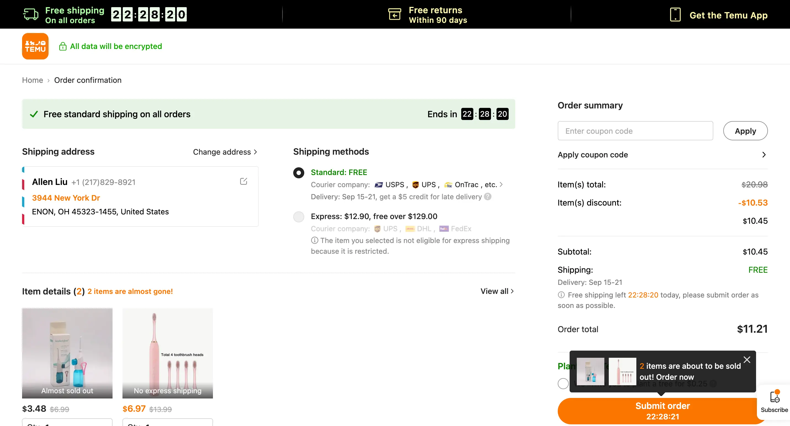

当你进入跨境电商这行业，转化率就变成了至关重要的目标。它是一个结果，却代表着很多：它代表成本，在流量成本越来越贵的当下，1.5%与1.3%意味着15%的成本差异；它代表竞争力，随着跨境从蓝海变红海，5%的差距可能都是致命的；它代表团队效率，从选品到建站到履约，每一个环节是否都做到了极致。人人都追求高转化率，但是不是所有人都知道，转化率具体意味着什么，有没有系统的方法论，是否有点石成金的小技巧等等。

如果你也有以上的困惑，不用担心，本文将从电商转化率的定义、转化率方法论、成功的实践等，全方位地介绍电商转化率的策略与技巧，让你不仅know-what，而且know-how。那么事不宜迟，让我们一起打开转化率大门，收获来自五湖四海的销售额吧！

## 指标篇-什么是电商转化率？

### 转化率的指标定义

电商转化率是指在一定的时间内，某个电商平台或网站上实现的销售与访客之间的比例。而具体到转化率的计算方法，不同的平台有不同的方法，一般来说会有以下3种转化率口径：

```Markdown
PV口径：电商转化率=订单数/网站访问量 x100%
UV口径：电商转化率=完成交易的用户数/网站访客数 x100%
PV/UV口径：电商转化率=订单数/网站访客数 x100%
```

例如，如果电商网站在一天中有1000个访问者，累计5000次访问量，其中有50个用户完成了购买，累计有100个订单。那么，该网站的转化率在不同的口径下分别如下：

```Markdown
PV口径：2%=100/5000 x100%
UV口径：5%=50/1000 x100%
PV/UV口径：10%=100/1000 x100%
```

可以看得出来，不同口径下的电商转化率差别非常大，所以如果有人跟你讲，我的网站或者平台转化率很高。你一定得先问一句：你的口径是什么。一般来说，因为一个用户可能会有超过一次的访问或交易行为，因此PV口径是最小的，其次是UV口径，然后是PV/UV口径（PV口径<=UV口径<=PV/UV口径）。

但这并不代表所有的商家都应该使用PV口径，并不是说最严格的便是最好的。如果你更关注订单，或者流量质量，那可以采用PV口径；如果你更关注用户，那可以采用UV口径；如果客均单量，或者行为次数，那可以采用PV/UV口径。就拿当前知名的电商平台或网站而言，他们通常使用的转化率口径如下：

|公司代表|口径|说明|
|---|---|---|
|Amazon|PV口径|Orders / all sessions|
|Shopify|PV口径|Converted sessions / all sessions|
|Lazada<br><br>Shopee|UV口径|Number of Buyers divided by number of Visitors during the selected period|
|淘宝|UV口径|产生购买行为的客户人数/ 所有到达店铺的访客人数|
|部分公司|PV/UV口径|-|

图1-1 主流电商平台的转化率口径

### 电商的平均转化率

平均无关紧要，自身同环比更重要。

转化率指标就像个人体重，你去跟社会平均体重对比，或者找最佳运动员对比，都没有太大意义。因为它会受很多因素影响，不同行业、不同商品、不同国家、不同人群、不同季节、不同销售渠道等等，都会千差万别。作为一个指标，转化率更重要的意义是跟自己对比，跟昨天、上周、上月对比，了解自我的涨跌，从而发现问题、分析问题、解决问题，最终收获增长。

在上面的前提下，我们再去了解行业的平均水平，帮助我们去建立转化率标准的基础认知。图1-2是主流电商网站的一些数据，可以看到电商平台比独立站普遍要更高，Amazon转化率最高，主要得益于其Amazon Prime等。

|公司代表|口径|平均水平|
|---|---|---|
|Amazon|PV口径|10%-15%|
|Shopify|PV口径|1%-2%|
|Lazada/Shopee|UV口径|5%-10%|
|淘宝|UV口径|6%-14%|

图1-2 主流电商网站平均转化率

数据来源：来自于Google搜索，数据未经审计

不同行业的转化率差异较大，根据IRP的统计数据（图1-3），工艺品、健康家居用品、厨房家居用品的转化率比较高，而婴幼用品、汽车配件的转化率相对较低。

 
图1-3 不同行业的平均转化率

数据来源：IRP commerce，PV口径

### 转化漏斗拆解方法

了解了转化率的一级指标后，接着我们进入二级指标的拆解。指标拆解的方法分为很多种，可以按照新老客转化拆解、按照流量渠道拆解、按照商品品类拆解等。其中，最常见的便是按照用户流程进行拆解，它帮助我们了解整体的转化漏斗现状，从而找到转化率的关键问题。下面给出的是电商常规的用户流程，以及对应的二级指标。在实际应用时，我们需要结合自己的用户流程进行调整。


|指标|定义|参考*|
|---|---|---|
|页面跳出率<br><br>Bounce rate|无点击/曝光<br><br>non-click/exposure|40%-60%|
|商品点击率<br><br>PDP click rate|商品点击/商品曝光<br><br>PDP click/exposure|0.8%-5%|
|商品加购率<br><br>Add-to-cart rate|商品加购/商详<br><br>Atc/PDP click|2.6%-8.1%|
|发起结账率<br><br>Checkout rate|准备支付/发起结账<br><br>Pre-pay/Begin checkout|20%-60%|
|支付成功率<br><br>Payment rate|支付成功/准备支付<br><br>Purchase/Pre-pay|70%-100%|

数据来源：littledata

## 理论篇-如何系统地提升转化率？

在进入方法论之前，请先闭上眼睛重温下，作为一个普通消费者，我们的购物流程是怎么样的：

> 周末的午后，爱丽丝到商场逛街，刚进门口就被琳琅满目的美妆专柜吸引。最近皮肤干燥，正需要一款补水面膜，然后发现一款新面膜系列，包装非常精美。销售员热情地介绍了产品特点，根据爱丽丝的肤质给予专业建议，同时帮助她试用了产品，确保不会过敏。经过试用，爱丽丝确实感觉很舒服，并没有夸大宣传。另外她还惊喜地发现，她喜欢的明星也代言了这款面膜，于是对它的信任又增进了几分。看到爱丽丝比较满意，销售员适时地提醒，这款产品限量发售，目前是品牌爆款，这批货只剩下少量库存，现在购买的话还有赠品。于是爱丽丝立刻下单购买，愉快地完成了此次购物。

无论是线下购物还是线上购物，购物流程的本质是相似的，我们可以把它抽象成三个阶段：激发兴趣>>建立信任>>立即下单 [1]。以爱丽丝的购物流程为例，首先她被新面膜的包装吸引，产生兴趣；然后经过销售员的专业建议以及明星代言，从而建立信任；最后在限量销售与优惠助推下，立即下单。提升电商的转化率，其实就是优化购物流程，我们把这套提升转化率的方法论称为“转化率三步曲”：


这三个阶段看起来是购物流程，本质上却是人的认知与行为的转化，其背后蕴藏着很多用户心理学与社会心理学。罗伯特·西奥迪尼在《影响力》中探讨了人们在购物与交往中是如何被影响和说服的，其中有六种常见的社会心理学策略，包括互惠原理、承诺与一致原理、社会证据原理、喜好原理、权威原理和稀缺原理 [2]。“转化率三步曲”在这六个策略的基础，结合电商转化率的场景和实践，总结出了10种常见心理学应用。

### 激发兴趣

认知心理学研究把人的感知的过程分为感觉、注意和识别三个主要阶段，首先是通过感官刺激，将外界信号传递给大脑；然后大脑将注意力进行分配，优先处理重要紧急的感觉输入；最后将感觉输入与已有经验知识匹配，经过识别后形成感知。

消费者对一个商品的兴趣是如何产生的呢？首先是与商品相关的因素让消费者**产生好奇**，从而激发继续了解的意愿；然后发现商品确实能满足消费场景的需求，**感觉是有用**的；接着看到商品价格是有接受的，或者有促销活动，对比下来**还挺划算**。好奇、有用、划算，这是消费者对商品产生兴趣的三个原因。三者没有严格的先后顺序，在实际应用中，可以根据商品特性主打一个维度，也可以组织一套组合拳。

#### **(1) 好奇心**

**心理学原理**

好奇心是人们追求新奇、探索和获取新信息的心理状态和动机，它是人类乃至动物与生俱来的天性。在进化心理学中，好奇心被看作是一种适应性特征，它促使人类主动寻求新的信息和经验。这种信息获取的行为有助于个体更好地适应环境，提高生存能力和繁衍成功的机会。

**电商应用场景**

- **新品发布和预告：**好奇心使用户希望了解新产品的信息。电商平台可以利用好奇心的心理，通过新品发布和预告功能，提前向用户展示即将推出的新产品，引发他们的好奇心，增加他们对新产品的关注度和购买意愿。
    
- **探索和发现功能：**好奇心驱使用户希望发现新的产品和品牌。电商平台可以提供探索和发现功能，例如淘宝和京东的逛逛，帮助用户发现他们可能感兴趣的新产品，满足他们的好奇心。
    

#### **(2) 认知相符理论**

**心理学原理**

认知相符理论是心理学中的一个概念，它描述了人们如何倾向于寻求与自身认知相符的信息，并如何处理与自身认知不符的信息。人们倾向于**追求认知一致性**，即希望自己的信念、态度和价值观与所接收到的信息相符。当面临与自身认知不一致的信息时，人们会选择性处理信息，倾向于与自身认知相符的信息，而忽视或排斥与自身认知不符的信息。

**电商应用场景**

- **故事叙述：**人们喜欢通过故事建立认知。企业或公司经常采用品牌故事来获得消费者认同，一般会采用创始人、产品、消费者等视角，讲述创始人如何开始，持之以恒地做产品，从不同消费者视角讲述产品与他们的关系，从而激发人们的兴趣。
    
- **价值观取向**：价值观根植于人们认知深处。正所以一般的企业销售产品，一流的企业销售价值观。人们会心甘情愿地为价值观认可的产品支付溢价。成功的企业往往都离不开成功的价值观取向，比如Coca-Cola、Apple。
    

> Patagonia通过对环保，吸引了一大批关注环境保护的消费者；TOMS（汤姆斯）是一家鞋类品牌，通过讲述每一双鞋背后的捐赠故事，吸引了一大批支持慈善事业的消费者。

#### **(3) 喜好原理**

**心理学原理**

喜好原理（Liking Principle）是《影响力》中的六大原理之一。它指的是人们更有可能受到那些他们喜欢、与之产生共鸣或与之相似的人的影响。影响人们喜好的因素有外表魅力、相似性、赞美、熟悉感等。

外表魅力具有一种光环效应，让人把这种好印象延伸到能力、内在等其他方面。人们也喜欢跟自己有相似特点的，比如来自同一地方、属于同样群体、有共同爱好等。人们喜欢赞美，特别是从第三方听到的，并且人们有恪守声誉的倾向。此外，人们喜欢熟悉喜好原理更强调的是相关性、共同点，通过建立消费者与产品的共同关系，达到“爱屋及乌”的效果。

**电商应用场景**

- **产品包装：**精美的产品包装吸引消费者的注意力（外表魅力）
    
- **店铺装修：**舒适、统一、无障碍的购物氛围（外表魅力）
    
- **高质量图片**：多角度、有细节、有场景的高清商品图片（外表魅力）
    
- **朋友/同城/社区**：朋友推荐、同城属性、线上社区群体等元素应用（相似性/熟悉感）
    

#### **(4) 痛点刺激**

**心理学原理**

人们倾向于回避痛苦。痛点刺激可以突出问题或挑战，使消费者意识到他们目前所面临的痛点，并提供解决方案。这种痛点的强调激发了消费者寻求改变和改善的意愿，从而促使他们采取行动。

**电商应用场景**

- **痛点刺激：**找到痛点-还原痛点-解决痛点。具体来说就是找到消费者对消费场景的厌恶点，用某种方式将这些厌恶点表现出来，突出产品如何让客户远离痛苦。痛点刺激方法经常会被用在医药保健类、婴幼用品、教辅产品、保险类等。
    

> 相信大家都被某肾宝品牌洗脑，它的广告便是痛点刺激的经典案例：肾虚（找到痛点），有时是在过度劳累之后，腰腿酸痛精神不振好像身体被掏空，是不是肾透支了（还原痛点）？ 想把肾透支的补起来，xx肾宝片，二十二味中药、温阳补肾、扶正固本。肾透支了，试试xx肾宝片，把肾透支的补起来（解决痛点）！他好，我也好！

#### **(5)** **互惠原理**

**心理学原理**

互惠原理（Reciprocity）是《影响力》中的六大原理之一。人们倾向于回报他人给予的好处和善意。当我们受到他人的恩惠或礼物时，我们感受到一种亏欠感，倾向于回报对方，而且往往回报的要比接受的恩惠要大得多。互惠的策略按接受度排序有：个性化恩惠>强加恩惠>拒绝-后撤策略。

**电商应用场景**

- **个性化营销**：提供个性化的营销活动，比如专属优惠、会员权益或定制化建议。这种个性化的关怀能够让客户感受到重视和特殊待遇，激发其回报的愿望，促使其更积极地支持品牌。
    
- **先用后付**：先把商品寄送给客户使用，打消客户的购物疑虑，同时在使用后产生亏欠感。比如拼多多联合微信支付分提供了该服务，提升了18%的转化率。
    
- **赠送礼品或样品**：向潜在客户提供免费的礼品或样品，通过善意的赠送来建立互惠关系。
    
- **限时促销**：拒绝-后撤策略的一种应用，常规商品正常定价，将限量或尾货商品做限时促销。比如唯品会就是运用该策略的商家。
    
- **免费配送**：免费配送无疑是亚马逊会员Prime项目最成功的策略之一，也成为了许多电商平台采用的核心策略。
    

### 建立信任

#### **(6) 承诺与一致原理**

**心理学原理**

承诺与一致原理（Commitment and Consistency）是《影响力》中的六大原理之一。人们倾向于保持与之前做出的承诺和行为一致的行为模式。一旦我们做出承诺或采取某种行动，我们更有可能遵循之前的决定，即使后续情况或观点发生了变化。

**电商应用场景**

1. 消费者的承诺与一致
    
    1. **商品评价**：鼓励消费者对产品做积极的评价，促使更多客户做出购买决策并保持一致
        
    2. **心愿单**：提供喜欢收藏的功能，以表明他们的兴趣和承诺
        
    3. **购物车**：允许消费者将产品先添加购物车，以表明他们的兴趣和承诺
        
    4. **邮件订阅及注册**：提供邮件订阅功能，让消费者做出初始承诺并注册成为会员
        
    5. **会员计划**： 提供完整的会员等级及权益计划，引导消费者逐步做出承诺和维持会员身份
        
    
      小步骤法：先喜欢收藏，再做个性化推荐和提醒；先添加购物车，再做购物车提醒；先领券，后订阅或注册；先购买，再推出会员礼包。
    
2. 商家的承诺与一致
    
    1. **品牌设计一致性**：商家首先确立品牌方向，然后做可视化表达，包括视觉统一规范、界面和布局一致、内容风格一致、响应式设计、用户交互体验等
        
    2. **营销表达一致性**：营销关键信息可视化；购物链路上统一；多渠道的表达一致性
        
    3. **价格计算一致性**：原价、销售价、促销价、会员价、实付价等在购物链路的统一，包括商品详情页、购物车、结账页等
        
    4. **消费者保护一致性**：支付安全、数据隐私、商品质量、物流保障等
        

#### **(7) 权威原理**

**心理学原理**

权威原理（Authority）是《影响力》中的六大原理之一。人们对具有权威地位、专业知识或经验的人或机构的意见和建议更容易接受和相信的心理倾向。

**电商应用场景**

- **专家认证**：通过专家认证或推荐来展示某些卖家或产品的专业知识和信誉
    
- **资质证书**：通过获得行业标准的资质认证来体现品牌或产品的可靠性
    
- **检测报告**：通过专业的检测报告突出产品在某方面的可靠与领先
    
- **名人代言**：通过名人背书提升品牌的认知度
    
- **权威媒体报道**：借助媒体渠道的权威性来提升信任感，比如央媒
    
- **专注XX年**：突出品牌的历史与专注度，体现产品的质量
    
- **投资人背景**：比如通过国资背景强调安全，纽交所上市强调国际化，红杉资本领投强调创新
    

#### **(8) 社会认同**

**心理学原理**

社会认同原理（Social identify）是《影响力》中的六大原理之一。它指的是在判断何为正确时，人们会根据别人的意见行事，也即是从众心理。在大多数情况下，它通常运作得很好，帮助人们符合社会规范、避免历史错误、提高决策质量。但是与此同时，人们对社会认同的反应方式是无意识的、条件反射式的，它不经由思考边直接给出结论。因此也容易被错误的意见误导，特别是在不确定环境下，一群相似的人都采用了相同的决策，而自己又缺乏足够信心时。

如《影响力》所说，光是指出一样东西的受欢迎程度，就能提升它的受欢迎程度。

**电商应用场景**

- **销量领先**：展示商品的销量，提供购买热榜和销量排名榜，这些榜单能吸引用户的注意力。对于品牌而言，可以宣传商品的总销量，并且用比喻手法推广，比如香飘飘奶茶一年卖出三亿多杯，能环绕地球一圈，连续七年，全国销量领先。
    
- **用户选择**：展示用户的数据，包括但不限于用户访问数、注册用户数、下单用户数、复购用户数、会员数等。根据平台或品牌需要，选择恰当的指标进行包装，比如xx人访问、xx人选择、xx个月xx客户口碑见证。
    
- **客户评价**：展示客户的评分、评论、使用体验等，能增加用户的信任感和购买欲望。真实评价有助于提升信任感，包括但不限于支持真实头像与名称、图片评价、视频评价等。
    
- **用户推荐及分享**：通过用户推荐和口碑传播来提高销售。例如，如果一个用户对某个产品感到满意，他可以分享自己的购买体验和评价，这将吸引更多的人关注和购买该产品。
    
- **社交媒体营销**：SCRM可以帮助企业在社交媒体平台上展开营销和推广活动，吸引更多的潜在顾客。企业可以通过社交媒体发布有关产品、促销活动和品牌故事的内容，与顾客进行互动，并利用社交媒体传播来扩大品牌影响力。
    

### 立即下单

#### **(9) 助推原理**

**心理学原理**

助推是诺贝尔奖得主理查德·塞勒提出一种行为策略，它是一种决策设计，给用户选择自由，同时基于某种动机，引导用户做出某种选择。由于用户存在有限的理性、缺乏自我控制以及从众效应，用户更容易受到符合天性动机的暗示提醒，而不是深思熟虑或被强行要求。

助推（Nudge）是一系列策略的组合，包括动机（iNcentives）、 理解权衡（Understand mappings）、 默认选项（Default）、 反馈（Give feedback）、 预计错误（Expect error）、 结构性复合选择（Structure complex choices）。从上述6个词语中各取一个字母，便恰好是“助推”（Nudge）[3]。

**电商应用场景**

在电商的立即下单方面，如何设计体验丝滑的购物链路，助推给了切实的启发与建议：

- **清除干扰**：减少与购物无关的要素，只保留最少的、必要的选项
    
- **设置默认选项**：帮助客户选择最优选项，永远要有默认选项，不要让用户只有选择才能到下一步
    
- **提供复合选项**：提供多种选项，比如多种登录方式、支付方式等，满足长尾用户的需求，不要成为卡点
    
- **预计错误及提醒**：遍历用户可能的错误场景，并给出可行动的错误提醒
    
- **及时反馈**：给用户及时的交互反馈，并且提供客户通道，能快速响应用户咨询
    

#### **(10) 稀缺原理**

**心理学原理**

稀缺原理（Scarcity）是《影响力》中的六大原理之一。“物以稀为贵”，人们认为难以获得的机会，价值会更高。它通常与损失厌恶心理相关，如果我们现在不采取行动，就会损失某种有价值的东西，而损失某物比想获得等价值的某物的激励作用更强。

**电商应用场景**

- **限量发售**：推出限量发售的产品，例如限量版商品、限量配色、限量库存等，创造库存上的稀缺性，刺激消费者的购买欲望
    
- **限时促销**：在特定时间段内提供限时特价，例如节假日大促、闪购、秒杀或每日特惠，创造时间上的稀缺性，迫使消费者在限定时间内做出购买决策
    
- **独家权益**：提供独家或VIP会员权益，如限定产品、专属服务或折扣，可以让高价值消费者感到特别和独特
    
- **倒计时**：倒计时是电商常用的方法，可以营造紧张氛围，促使消费者尽快下单
    
- **库存提醒**：显示剩余库存，并重点突出稀缺的品目
    
- **行动号召**：清晰的行动召唤(Call to action)，告诉消费者此刻应该做什么，并且通过交互设计重点标识出来
    

## 实践篇-10个不得不知的转化率技巧

查理·芒格总结了一个Lollapalooza效应，指的是多个相互联系的同向因素叠加后，会产生极强的放大作用[4]。在电商转化率的实际应用中，从来也不是“一招鲜”，而是多种原理综合应用，最终形成一些打法与技巧。以下是10个你不得不知的转化率技巧及案例：

1. ### 助推结账流程 Nudge checkout process
    

优化结账流程是提升转化率的关键，因为更靠近用户最终成单，可以帮商家收获本该到手的订单。那么，如何提供最好的结账流程？一方面是减少摩擦，为用户提供体验丝滑的结账体验；另一方面是提升动力，让用户主动快速完成结账流程。

减少摩擦主要在体验上优化，就好像冰壶运动中的刷冰一样，需要持续打磨流程，包括清晰的流程、最少的输出项、本地化地址裤、自动填充、默认选项、错误提醒、允许游客结账、允许社媒注册登录等。

提升动力主要在稀缺、营销、支付等方面助力，综合应用各种心理动力学，比如通过倒计时强调优惠与库存、清晰展示已有营销优惠、提供丰富的支付方式、提供支付优惠等。

以shoplazza为例，提供了单结账、标准结账页选项，同时允许商家自定义所有输入项，可以根据国家自定义最佳实践，并且对于未完成订单、已登陆用户做了自动信息填充，极大地优化了用户体验，提升结账转化率。

Shoplazza - 结账页
 

2. ### 个性化智能推荐 Intelligent recommedation
    

个性化智能推荐是一种利用机器学习和数据分析技术，根据用户的兴趣、偏好和行为模式，向其提供个性化的推荐内容或建议的方法。它基于对用户的历史行为数据、社交网络数据、购买记录等进行分析和挖掘，以了解用户的兴趣和需求，并根据这些信息生成针对个体用户的推荐结果。

在电商中，所有的购物链路都可以使用个性化智能推荐，包括商城首页、弹窗、搜索页、商品详情页、购物车、结账页、支付成功页、邮件等。智能推荐可以提供更好的用户，帮助用户发现他们可能感兴趣的产品，提高用户的购物意愿和客单价。

以Shoplazza为例，智能商品推荐插件支持购物链路场景的商品推荐，特别是购后场景，支持消费者快捷下单，省掉二次信息填写，转化率极大提升，帮助商家提升5%-10%的收入。

Shoplazza - 智能商品推荐 -购后推荐


3. ### 视频化故事叙述 Video storytelling
    

视频是符合消费者喜好的传播方式，并且能承载更丰富的内容信息，如果结合产品品牌或价值观讲好一个故事，将能高效地激发消费者的兴趣，对网站产生爱不释手的好感。当采用这个方法时，需要注意两点：1）控制视频大小，不能让视频过度影响网页加载速度；2）定期更新视频，消费者永远喜新厌旧，通过新视频持续传递不变的价值观。

举个例子，Cowboy是我最爱的网站之一，它是销售城市自行车的品牌，在网站首页会放上城市背景下骑车的片段，有时还会带一些有趣的情节。再以Gucci为例，进入网站便是超模的视频，进入电梯、回眸一笑、电梯合上，仿佛在说Come in，高级而诱人。

www.cowboy.com
www.gucci.com

  

4. ### 一致性网站设计 Consistent design
    

网站设计是品牌的语言，通过一致性的设计，从而传递独特的价值观。品牌可以在以下方面达到一致性设计：视觉统一规范，包括品牌标识、图标、颜色、字体、图形风格等；界面和布局一致，包括统一的导航栏、页头、页脚、按钮样式等；内容风格一致，包括语言风格、用词、表达方式、声音等；响应式设计一致，网站自适应于不同的设备，如桌面、平板、移动设备；用户交互体验一致，交互元素的设计和行为方式都是一致的。

以Kylie Cosmetics为例，它是卡戴珊家族Kylie Jenner创建的美妆品牌，整个网站以粉红为主的暖色调，字体统一采用Tt-Chocolate，内容字体都用小写，弱化营销氛围，强调产品质量、用户好评，以及最大KOL Kylie Jenner的名人背书。

https://kyliecosmetics.com/


5. ### 优化网页速度 Optimize page speed
    

根据Websitebuilderexpert统计数据显示，当网站加载时间超过3秒时，约有40%的消费者会失去继续等待的兴趣。当加载速度从3秒到4秒时，网页的跳出率会翻番，后面每多出1秒，都可能导致10%的用户流失。因此，对于电商网站而言，需要持续关注及优化网页速度，特别是直接做广告投放的页面，尽量控制在3秒以内。

可以采用[Google Pagespeed工具](https://pagespeed.web.dev/)来辅助检查网页的加载速度及性能，并且参考其中建议持续优化：


6. ### 强调信任和安全性 Trust and safety
    

消费者使用电商购物时，一般会重点关注以下几个方面的安全性：支付安全、产品质量、配送保障、数据隐私等。为了应对客户的担忧，电商平台会提供相应的安全承诺，包括第三方支付背书、无条件退换货、配送时效承诺及运费险、数据隐私保护等。

以拼多多为例，在国内基本不会强调安全性，但是进入美国市场的Temu则不然。在Temu的整个购物链路，从商城首页到商详页到购物车到结账页，Shopping security贯穿始终。

https://www.temu.com


7. ### 线上产品推广 Online product promotion
    

线上产品推广主要通过商品详情页来承载，一个好的商品详情页应该包括清晰的视图呈现、详细的产品信息、强大的行动召唤。高清、高质量的图片和视频是商品详情页的关键，图片一般包括主图、不同角度的细节图、不同款式的图、场景图等，视频则可以展示产品的使用效果。产品信息应该包括产品名称、描述、规格、价格、配送信息等，描述应该简明扼要，突出产品的核心功能和优势。此外还要有清晰的行动召唤，可以是“立即购买”、“加入购物车”、“领取优惠券”等，要重点考虑移动端的体验，做按钮的强化。

以Apple AirPods Pro，页面通过视频、响应式设计、高质量图片等，充分展示了产品的外观、使用效果，商品信息非常详细，页面顶部有醒目的“购买”按钮，引导用户完成购买。

https://www.apple.com/airpods-pro/


8. ### 添加社会证据 Add social proof
    

电商的社会证据包括其他用户评分、产品评论、社媒评论、购买记录、推荐、收藏等，通过添加社会证据可以帮助用户判断商品的质量和价值，降低购物风险，提高用户的购买意愿。添加社会证据有三个技巧可以采用：1）**足够丰富**，不同形式、不同用户、不同渠道的，交叉验证证据可信；2）**足够真实**，使用真实用户头像、最新或动态的消息、社媒反馈等，确保真实性；3）**足够显眼**，将社会证据放在显眼的位置，让用户容易看到。

以Temu的商品详情页为例，商品销量、店铺销量、商品评分跟随标题展示，而具体的商品评论、店铺评论在商品主题下方，同时将用户购买动态以小浮窗及跑马灯的方式滚动呈现，为商品提供社会证据，引导消费者加购。

https://www.temu.com
 

9. ### 大促活动运营 Campaign operation
    

大促活动是电商常用的营销手段，也是多种心理学原理的综合应用。一般会选择某个节日作为营销噱头，它既和用户认知相符，又辅以较大优惠折扣，极大地激发消费者的兴趣。同时，通过站外与站内的联合宣传，铺天盖地的表达营销承诺，保持活动的一致性。此外，大促不是天天有，通过限时折扣营造其稀缺性。

对于商家而言，要做好一场大促活动，需要首先明确活动目标，确定此次大促的目标是提高品牌知名度、提高产品销售、清理库存尾货还是主推某些新品；然后根据活动目标，选择合适的活动类型，比如限时促销、新品优惠券、全场满减、返现等等；接着就是活动执行，做好物料设计、活动配置、多渠道宣传，吸引用户参与；最后就是要跟踪活动效果，根据实际情况进行调整。

Shopee - 9.9活动大促


10. ### 提供免邮服务 Offer free shipping
    

根据Ometrics研究表明，添加免邮服务能够提升电商店铺20%以上的转化率。免邮服务可以消除用户购买的心理阻力，降低购物车弃单率，同时为了达到免邮门槛，以及对优惠的损失厌恶，可以增强用户购物意愿。一般情况下，电商平台会提供以下几种免邮机制，包括满额免邮、会员免邮、限时免邮、区域免邮、商品免邮等。

以美国的电商平台为例，大多数的免邮政策都包括面额免邮和会员免邮，如Amazon Prime会员免邮，非会员满25美金免邮；SHEIN会员免邮，非会员满50美元免邮；TEMU当前在推广阶段，商品满$10美元起送且免邮。

TEMU - Cart Shipping Cart


## 附录1-提及书籍

[1] 《超级转化率》陈勇

[2] 《影响力》罗伯特·西奥迪尼

[3] 《助推》理查德·塞勒

[4] 《穷查理宝典》查理·芒格

  

## 附录2-提及网站
|网站名称|链接|
|---|---|
|Patagonia|[www.patagonia.com](https://www.patagonia.com/home/)|
|Shoplazza|[www.shoplazza.com](https://www.shoplazza.com/)|
|Cowboy|[www.cowboy.com](http://www.cowboy.com)|
|Gucci|[www.gucci.com](http://www.gucci.com)|
|Kyliecosmetics|[www.kyliecosmetics.com](https://kyliecosmetics.com/)|
|Google Pagespeed|[pagespeed.web.dev](https://pagespeed.web.dev/)|
|TEMU|[www.temu.com](http://www.temu.com)|
|Apple Airpods|[www.apple.com/airpods-pro/](http://www.apple.com/airpods-pro/)|
|Shopee|[shopee.co.id](http://shopee.co.id/)|