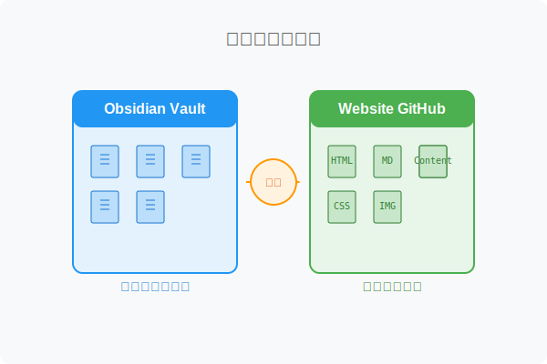
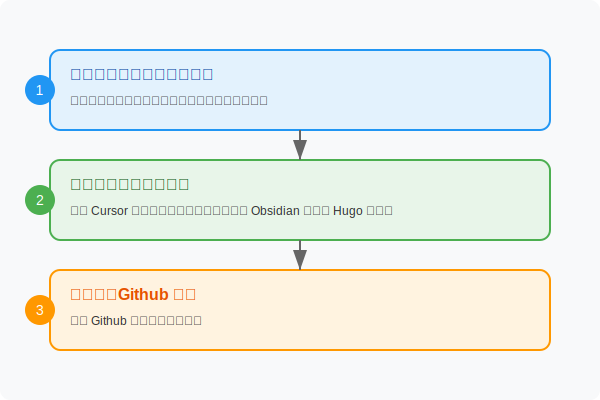

"一次写作，随处发布"——这是内容创作者的终极梦想。而我，终于找到了一种既能享受 Obsidian 强大知识管理能力，又能轻松发布到个人网站的完美工作流。想知道我是如何做到的吗？

## 独立文件夹：避免混乱的第一步

首先，需要明确一个原则：我的博客内容文件夹与 Obsidian 文件夹是相互独立的。此前，我曾尝试将两者放在同一个大文件夹下，但发现这样容易导致混乱。也尝试过通过脚本实现文件夹同步，使两者成为镜像，但在实际操作中，这种方式会对 Hugo 的发布流程产生诸多 bug。因此，为了避免相互干扰，我最终选择将两者分别管理于不同的文件夹中。


在此基础上，我的整体发布流程可以理解为：在 Obsidian 中完成文档撰写后，需要将文档从 Obsidian 文件夹移动到 GitHub>Content 文件夹。为简化操作，我编写了自动化代码，实现了这一过程的自动迁移。
## 三步走：从笔记到网站的无缝转换
具体的发布流程分为三个部分。第一步，是为新建的博客内容添加属性标签页头。我专门创建了一个博客模板，每当需要发布新内容时，便通过该模板为文档添加所需的页头标签和属性。第二步，在文章完成后，我会运行一个由 Cursor 编写的自动化程序。该程序主要实现两个功能：一是将 Obsidian 笔记中使用的图片素材转换为网页所需的格式（因两者格式不同）；二是将文档从 Obsidian 文件夹移动到 Hugo 文件夹，即我的 Github 文件夹。第三步，则是通过 Github 进行推送。具体如下：


### 第一步，添加 yaml 页头
为了提升这一步的效率，你可以安装 Templater 插件，添加一个 blog template，把 yaml 页头添加到模版里。以下是 blog template 参考：
```
---
title: "" 
date: "" 
description: "" 
tags: [""]
showTableOfContents: 
showTaxonomies: 
series: [""]
series_order: 
category:
published:
---

说明：
title: "AI时代，我用Cursor搭建了一个可持续更新的个人网站，这是我的血泪教训"  # 自动提取当前页面标题
date: "2025-04-24"  # 自动提取当前页面标题，发布日期
description: "AI赋能零基础建站，从踩坑到进阶，记录用Cursor打造可持续更新个人网站的实战与思考。" 
tags: ["AI 编程"] 
showTableOfContents: true # 是否在文章展示目录
showTaxonomies: true # 是否加入标签页
series: ["AI 编程"] # 属于哪个系列
series_order: 1 # 在系列中的排序
category: blog # 属于哪个专辑页，我的个人网站分为 blog, newsletter, projects, tutorial
published: true
```

### 第二步，复制文件到 GitHub
如果你的文档不含图片，如果图片是webp或者是图片链接，你也可以手动把文件复制到对应的 content 文件夹。
如果你的文档包含本地图片，那么图片的引用需要做一层转换，因为 Obsidian 常规的图片存储方式和 Hugo 不太一样。一般情况下，Obsidian 的图片会放在 assets/images下统一存储，而 Hugo 默认使用 **Page Bundle**，放在与 index.md 同一目录：

```
content/
├── _index.md              ← 主页内容（可选）
├── blog/                  ← 博客文章
│   └── post-title-1/
│       ├── index.md       ← 文章 Markdown（含 Front Matter）
│       └── featured.png      ← 封面图片
│       └── image1.png      ←  文章图片
│   └── post-title-2/
│       └── index.md
```
为了不改变我的文件存储习惯，而且我的图片有很多截图，因此就写了Cursor 写了个 Python 代码，并且打包成 command 应用，帮我自动按照 hugo 格式复制文档和图片，并且复制到对应的 GitHub>Content>{分类子文件夹}。

> [!NOTE] 额外福利
> 如果你需要这个程序及代码，在公众号后台留言"发布代码"，即可获得详细完整的代码。

后来，我发现一个更佳的解决方案，推荐搭建使用：
- 安装 **Image Converter**插件，自动帮你把复制的图片转成 Webp
### 第三步，到 Github 项目根目录，执行预览发布
3.1 现在本地预览
```
   hugo server -D
```
3.2 发布到线上
```
   git add content
   git commit -m "chore: 更新内容"
   git push origin master
```

以上就是关于 Obsidian >> Website的完整发布流程，下一期将给大家带来如何把 Obsidian 变成 CMS 管理多渠道的内容。
## 写在最后

如果你觉得这篇文章对你有帮助，欢迎在评论区留言分享你的想法或问题，赞赏虽好，在看更佳。
关注我的公众号【体验官学锋】，我会持续分享更多关于AI 硬核实践的经验。期待下次再会。
